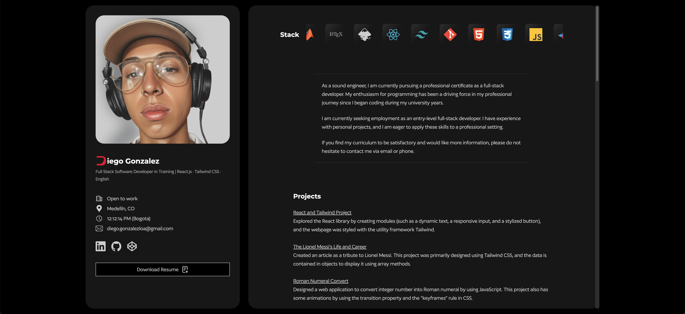

<h1>My Website</h1>

<p>This project is Diego's website that works as a resume. There appears all info about my projects, education, and social media links. If you are interested in working with or knowing more about me, you can enter to it. <a href="https://diegogonzalezloa.github.io/my-website/">Link</a></p>

<h4>Used Technologies</h4>




<h2>Run in Your Local Repository </h2>

<h3>Clone</h3>

First, you have to fork this remote repository, and then clone the forked repository. To clone it, you have to navigate to the desired directory where you want to clone the repository, using `cd`. Then, type the following command line:

```
git clone https://github.com/<your-username>/<name-of-the-repository>.git
```

Finally, open the cloned repository with the command `cd <name-of-the-repository>`

<h3>Install dependencies</h3>

To install all necessary dependencies, you need to already have installed Node.js (or any package manager). This React project was created based on the build tool Vite; for that reason, run the following command to install the Vite's dependencies:

```bash
npm install
# or
yarn install
# or
pnpm install
```

You also have to install Tailwind's dependencies using the following command:

```bash
npm install tailwindcss @tailwindcss/vite # or yarn / pnpm
```

<h3>Start the development server</h3>

Just run this command line:

```bash
npm run dev # or yarn / pnpm
```

Then press the key `o` or click on the local link `http://localhost:5173/`

<h2>License</h2>

<a href="LICENSE.txt" target="_blank" rel="noopener noreferrer">Apache 2.0</a>

<h2>Author</h2>

Diego Gonzalez
